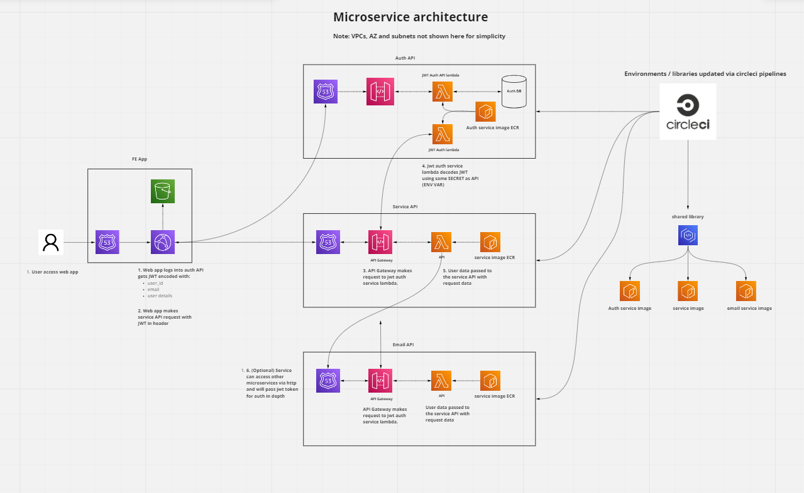

# Authorizer

A serverless (AWS lambda) FastAPI authorizer microservice intended to be used with lambda api gateways to authenticate and pass authorization data to microservices.

# Requirements

This project requires installed on your OS.

- docker and docker-compose
- makefile command
- terraform (version 1.1.1)
- git bash (if running on windows)

# Running locally

To start the project run the command:

`make run`

This will build a lambda compatible docker container running fast api that can be accessed via:

`http://localhost:8888`

It is possible to send events to the lambda worker running the RIE lambda emulator API by running the following command:

`curl -XPOST "http://localhost:9000/2015-03-31/functions/function/invocations" -d '{"Records": [{"body": \"{\"pdf_id\": \"test\", \"params\": {}}"}]}'`

Sample json payload:

```
{
  "Records": [
    {
      "messageId": "19dd0b57-b21e-4ac1-bd88-01bbb068cb78",
      "receiptHandle": "MessageReceiptHandle",
      "body": {
          "pdf_id": "test",
          "params": {}
      },
      "attributes": {
        "ApproximateReceiveCount": "1",
        "SentTimestamp": "1523232000000",
        "SenderId": "123456789012",
        "ApproximateFirstReceiveTimestamp": "1523232000001"
      },
      "messageAttributes": {},
      "md5OfBody": "{{{md5_of_body}}}",
      "eventSource": "aws:sqs",
      "eventSourceARN": "arn:aws:sqs:us-east-1:123456789012:MyQueue",
      "awsRegion": "us-east-1"
    }
  ]
}
```


# Adding Auth to other lambda microservices

In order to add this authorizer to another service, we need to add it to it's API Gatway resource. This will require re-creating the resource and adding this service as an authorizer. More details are available here.

https://docs.aws.amazon.com/apigateway/latest/developerguide/configure-api-gateway-lambda-authorization-with-console.html

Here is a diagram showing how this project plugs into other microservices.



# Deploying to AWS

Deployment is done when we merge a branch into main on github and the following is orchestrated through the .circleci/config.yml. Before the pipeline will work we require some inital pipeline setup.

Before running any of the below add AWS credentials via terraform ENV Vars:

export TF_VAR_aws_access_key=""
export TF_VAR_aws_secret_key=""

These will also need to be added to our circleci pipeline for the automated pipeline to work correctly.

An S3 bucket to hold the terraform state is needed before commands work create the S3 bucket that matches the s3 bucket in infra/tf_pipeline/main.tf:

`jwnwilson-authorizer`

### Set param store values

In order to create our DB we need to set some params in aws, this has to be done manually in the AWS console.

data "aws_ssm_parameter" "access_token" {
  name = "/authorizer/${var.environment}/access_token"
}

data "aws_ssm_parameter" "email_url" {
  name = "/authorizer/${var.environment}/email_url"
}

data "aws_ssm_parameter" "secret" {
  name = "/authorizer/${var.environment}/secret"
}

data "aws_ssm_parameter" "username" {
  name = "/authorizer/${var.environment}/username"
}

data "aws_ssm_parameter" "password" {
  name = "/authorizer/${var.environment}/password"
}

### Create pipeline

First we need to create infra for pipeline and to push a docker image, from the infra/ folder run: 

`AWS_DEFAULT_REGION=eu-west-1 environment=staging make init_pipeline`
`AWS_DEFAULT_REGION=eu-west-1 environment=staging make apply_pipeline`

This is will create our ECR repo we need to push an image to, the automated pipeline should work from this point on.

## Build image

From the root repo directory run:

`AWS_DEFAULT_REGION=eu-west-1 environment=staging make build push`

This will build an image, tag it and push it to the ECR repository. This will use the aws credentials created by aws CLI stored in ~/.aws/credentials. 

## Deploying image

Get the docker tag from the previous build push command, then inside infra/ folder run:

`AWS_DEFAULT_REGION=eu-west-1 environment=staging make init`
`AWS_DEFAULT_REGION=eu-west-1 environment=staging docker_tag=<docker_tag> make plan`
`AWS_DEFAULT_REGION=eu-west-1 environment=staging docker_tag=<docker_tag> make apply`

This will prepare and build a staging environment for this project, to destroy the environment run:

`AWS_DEFAULT_REGION=eu-west-1 environment=staging make destroy`

To create a different environment run:

`AWS_DEFAULT_REGION=eu-west-1 environment=test make init`
`AWS_DEFAULT_REGION=eu-west-1 environment=test docker_tag=<docker_tag> make plan`
`AWS_DEFAULT_REGION=eu-west-1 environment=test docker_tag=<docker_tag> make apply`

# DB Management

To get access to our DB we need a bastion machine created, firstly get the authorizer VPC and DB URL from the AWS console or run:
`cd infra && make outputs`

Update the variables in `infra/Makefile` with the correct VPC and DB_URL for the authorizer service then run. 

```
cd infra
make bastion_init
make bastion_appy
```

Once the machine build access with:

`cd infra && make bastion_ssh`

To setup a local port to access the RDS DB with run:

`cd infra && make bastion_db_tunnel` 

This is how DB migrations are currently done.

# Domain Driven Development

The structure of this project is based on a DDD programming technique "Hexagonal architecture" as described here:
https://medium.com/ssense-tech/hexagonal-architecture-there-are-always-two-sides-to-every-story-bc0780ed7d9c

The goal is to avoid coupling logic so that it can be re-used across projects.

# To Do

- Automate DB migrations with alembic on lamdba in circle